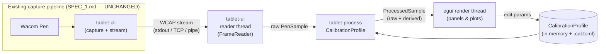

# Calibration & Visualization UI — Software Specification (SPEC_CUI.md)

> Reference specification for a native desktop tool that **visualizes** captured
> Wacom pen input and lets the user **tune how that input is processed** —
> without touching the raw capture pipeline described in `SPEC_1.md`.
>
> Status: design reference (pre-implementation for this feature). Builds on the
> existing capture workspace; `SPEC_1.md` remains the source of truth for the
> capture/streaming architecture and is **not modified** by this feature.

---

## 1. Overview and Goals

### 1.1 Purpose
The capture tool (`SPEC_1.md`) streams lossless, full-resolution `PenSample`
data. This feature adds a **separate, self-contained** application that:

1. **Visualizes** the live pen input (position trace, pressure, tilt, twist,
   proximity, tool identity) so the user can confirm fidelity at a glance.
2. **Troubleshoots** the stream (report rate, dropped samples, serial gaps,
   latency, queue depth, proximity/tool events).
3. Lets the user **tweak how captured data is processed/used** — coordinate
   mapping, pressure response, tilt derivation, smoothing, activation thresholds
   — and see the effect **live, side by side with the raw signal**.
4. **Exports a reusable calibration profile** that downstream features consume,
   so the same processing is applied consistently everywhere.

### 1.2 The core principle: raw stays raw
The capture layer emits faithful, unprocessed data and must keep doing so. **All
processing introduced here is non-destructive and lives downstream of capture.**
The UI consumes the existing wire stream read-only; it never reconfigures the
Wintab context, never alters the wire protocol, and never mutates a `PenSample`.
Processed values are *derived alongside* the raw values, never in place.

This keeps two concerns cleanly separated:
- **Capture** (`SPEC_1.md`): "what the hardware actually reported."
- **Processing** (this spec): "how we choose to interpret/use that for a given
  application," captured as a tunable, serializable profile.

### 1.3 Primary goals
1. **Faithful visualization** of every axis the stream carries, at interactive
   frame rates, decoupled from the (higher) capture rate.
2. **Live, reversible processing** driven by a `CalibrationProfile`; raw and
   processed views are always both available for comparison.
3. **A reusable processing library** (`tablet-process`) that the UI and future
   consumer features share, so a profile tuned in the UI behaves identically in
   production code.
4. **Zero impact on the capture pipeline.** New crates depend only on the
   existing public APIs of `tablet-core` and `tablet-stream`.

### 1.4 Non-goals
- No changes to capture, decode, the wire protocol, or `tablet-core` /
  `tablet-wintab` / `tablet-stream` internals.
- No reconfiguration of the live Wintab context from the UI (rate, queue depth,
  packet fields, flip-Y remain the producer's CLI/TOML concern, `SPEC_1.md` §9).
  Those are *capture* settings; this feature tunes *processing* settings.
- No browser, web server, or JS toolchain — this is a native application.
- No gesture recognition, inking/rendering engine, or ML. The visualization is a
  diagnostic/calibration surface, not a drawing app.

---

## 2. Requirements

### 2.1 Functional requirements
- Connect to a running capture producer over its existing transports (stdin
  pipe, TCP, Windows named pipe) and decode the stream with the existing
  `FrameReader` (`SPEC_1.md` §7).
- Render the device handshake (`DeviceCapabilities`) and use its axis ranges to
  drive normalization, axis labels, and out-of-range warnings.
- Display, in real time: an XY trace, pressure over time + histogram, a tilt /
  azimuth indicator, twist/rotation, proximity/tool state, and a raw-sample
  inspector.
- Apply a `CalibrationProfile` to each sample and visualize **raw vs processed**
  simultaneously (overlay or split view).
- Edit every processing parameter through UI controls and reflect changes on the
  next frame (no stream reconnect required).
- Load and save `CalibrationProfile` files (TOML default, JSON optional).
- Surface stream health: packets/s, dropped count (from `Metrics` frames and
  from local serial-gap detection), queue depth, connection state.

### 2.2 Non-functional requirements
- **Interactive frame rate** (target 60 fps) regardless of capture rate; the UI
  aggregates/decimates for display and never blocks on the stream.
- **Bounded memory:** fixed-size history ring buffers for plots; old samples are
  evicted, never accumulated unbounded.
- **No back-pressure on the producer:** the reader drains the transport
  promptly; if the UI falls behind, it drops display samples (it is a viewer),
  mirroring the capture layer's drop-oldest philosophy (`SPEC_1.md` §7.4).
- **Cross-platform dev:** the UI builds and runs on any OS against a stream,
  including the `MockBackend` producer, so it is testable without hardware
  (`SPEC_1.md` §12).
- **Deterministic processing:** `tablet-process` is pure (no I/O, no clock
  reads) so the same profile + samples always yield the same output, enabling
  unit tests and reproducible downstream behavior.

---

## 3. Architecture

### 3.1 Where this fits


The UI is a **read-only consumer** of the same stream a production consumer
would read. Nothing flows back toward capture.

### 3.2 New crates (self-contained)
Two new workspace members; **no existing crate is modified.**

| Crate | Kind | Depends on | Role |
| --- | --- | --- | --- |
| `tablet-process` | library (OS-agnostic) | `tablet-core`, `serde` | Processing/calibration model: `CalibrationProfile`, stages, `ProcessedSample`, pure transforms. Reusable by future features. |
| `tablet-ui` | binary (native GUI) | `eframe`/`egui`, `egui_plot`, `tablet-core`, `tablet-stream`, `tablet-process` | The visualization + calibration application. |

`tablet-process` is intentionally free of any UI or OS dependency so the
**downstream features the user plans to build** can apply the exact profile the
UI produces, with no egui or stream coupling.

### 3.3 Tech stack: egui / eframe (native, no browser)
- **`eframe` + `egui`** — immediate-mode GUI; ideal for real-time, per-frame
  data visualization, trivial to wire to a shared sample buffer, cross-platform,
  pure-Rust, single binary. No web stack.
- **`egui_plot`** — line/scatter plots for pressure-over-time, histograms, and
  the pressure-response-curve editor.
- Custom `egui::Painter` drawing for the XY trace canvas and tilt indicator
  (full control over stroke width modulation and overlays).
- Alternatives considered and rejected per §1.4: web frontend (adds a browser +
  WS bridge + serialization on the hot path) and Tauri (webview + IPC boundary).

### 3.4 Thread model
Two threads, mirroring the producer/consumer split already used in the runtime
(`SPEC_1.md` §4.3):

- **Reader thread:** owns the transport + `FrameReader`; loops `read_message()`,
  decodes `StreamMessage`, and pushes into a shared, bounded buffer. Tracks
  connection state and local serial-gap counts. Never touches egui state.
- **UI thread (eframe main):** on each repaint, drains the shared buffer, runs
  each sample through `tablet-process`, appends to fixed-size history rings, and
  draws. Owns all `CalibrationProfile` edits.

Hand-off is a bounded SPSC ring (`rtrb`, already a workspace dep) or a
`Mutex<VecDeque>` with a cap; overflow drops oldest **display** samples and
increments a `display_dropped` counter shown in the UI. The producer is never
blocked.

```text
[Reader thread] --decode--> bounded display buffer --drain--> [UI thread: process + draw]
```

---

## 4. Processing model (`tablet-process`)

The heart of "tweak how we use the captured data." A `CalibrationProfile` is an
ordered, non-destructive pipeline. Each stage reads the raw `PenSample` (and the
running processed state) and writes derived fields; the original sample is always
retained.

### 4.1 `ProcessedSample`
```rust
/// A raw sample plus everything the active CalibrationProfile derived from it.
/// `raw` is never mutated, so consumers can always fall back to ground truth.
pub struct ProcessedSample {
    /// Untouched capture sample (SPEC_1.md §5.1).
    pub raw: PenSample,

    /// Position mapped into the profile's target space (see TargetSpace).
    pub x: f64,
    pub y: f64,
    /// Optional smoothed/filtered position (None if smoothing disabled).
    pub x_filtered: Option<f64>,
    pub y_filtered: Option<f64>,

    /// Pressure after the response curve + clamp, in [0.0, 1.0].
    pub pressure: f64,
    /// Whether the pen is "active"/in-contact per the activation threshold.
    pub active: bool,

    /// Tilt expressed in the profile's chosen convention/units.
    pub tilt_x: Option<f64>,
    pub tilt_y: Option<f64>,
    pub twist: Option<f64>,

    /// True if any axis fell outside DeviceCapabilities range this sample.
    pub out_of_range: bool,
}
```

### 4.2 Pipeline stages
Each stage is independently toggleable and parameterized; disabled stages pass
their inputs through unchanged.

1. **Coordinate mapping.** Map raw digitizer units → a `TargetSpace`
   (`Normalized` [0,1], `ScreenPixels{w,h}`, or `Millimeters` using axis
   `resolution` from `DeviceCapabilities`). Transform is an affine (and optional
   projective) matrix supporting offset, scale, flip, and rotation. Can be set
   manually or **fit from an N-point calibration** (§4.3).
2. **Pressure response.** Clamp raw pressure to a learned/observed `[min,max]`,
   then remap through a curve: `gamma`, `linear`, or `custom` (monotone control
   points). Output normalized to `[0,1]`.
3. **Tilt / orientation derivation.** Choose the convention to expose:
   azimuth+altitude (as captured) vs `tilt_x`/`tilt_y` degrees (already derived
   in `PenSample`), select units, and optionally low-pass smooth.
4. **Smoothing / filtering (position).** Optional `EMA` or `OneEuro` filter for
   position only, producing `x_filtered`/`y_filtered`. Clearly a *processing
   convenience*; raw and mapped positions remain available.
5. **Activation / hover thresholds.** Derive `active` from a pressure-on / -off
   threshold (with hysteresis) and/or proximity, so consumers get a clean
   contact signal without inspecting raw pressure.

### 4.3 N-point geometry calibration
A helper fits the coordinate-mapping transform from collected
`(raw_xy, target_xy)` pairs:
- ≥2 points → similarity (scale + rotation + translation, least squares).
- ≥4 points → full affine or projective (homography) fit.
- Reports per-point residuals and RMS error so the user can judge quality and
  re-collect bad points. The fitted matrix is written back into the profile's
  coordinate-mapping stage.

### 4.4 `CalibrationProfile` (serializable artifact)
```rust
pub struct CalibrationProfile {
    pub name: String,
    pub target_space: TargetSpace,
    pub coordinate_map: CoordinateMap,   // affine/projective + enabled flag
    pub pressure: PressureCurve,         // min/max + curve kind + points
    pub tilt: TiltConfig,                // convention, units, smoothing
    pub smoothing: SmoothingConfig,      // off | ema(alpha) | one_euro(params)
    pub activation: ActivationConfig,    // thresholds + hysteresis
}
```
Serialized via `serde` to **`*.cal.toml`** (default) or JSON. This file is the
contract between the calibration UI and downstream features: a feature loads the
profile and calls `profile.apply(&pen_sample) -> ProcessedSample`, getting the
exact behavior previewed in the UI.

### 4.5 Public API surface
```rust
impl CalibrationProfile {
    pub fn identity() -> Self;                 // pass-through; raw == processed
    pub fn apply(&self, raw: &PenSample, caps: &DeviceCapabilities) -> ProcessedSample;
    pub fn fit_geometry(&mut self, points: &[(/*raw*/ (f64,f64), /*target*/ (f64,f64))]) -> FitReport;
    pub fn load(path: &Path) -> Result<Self, ProfileError>;
    pub fn save(&self, path: &Path) -> Result<(), ProfileError>;
}
```
`apply` is pure and allocation-light; smoothing state (for `OneEuro`/`EMA`) is
held by a separate `ProcessorState` the caller threads through, keeping
`CalibrationProfile` a plain data value.

---

## 5. Data source (`tablet-ui` ingestion)

### 5.1 Connected consumer (the only mode)
The UI reads the **existing** stream — no capture ownership, no new transport.
It reuses `tablet-stream::FrameReader` exactly as the reference consumer does
(`docs/consumer.md`):

- **stdin:** `tablet-cli --transport stdout | tablet-ui` (postcard or JSON).
- **TCP:** `tablet-ui --tcp 127.0.0.1:9123` connects to a running producer.
- **named pipe (Windows):** `tablet-ui --pipe wacom-capture`.

Format (`postcard` | `json`) is selectable, matching the producer.

### 5.2 Optional convenience: launch the producer
As a usability nicety (not a requirement), the UI may offer to spawn
`tablet-cli` as a **child process** with chosen capture flags and read its
stdout. This is process orchestration only — it still consumes the normal
stream, changes nothing in the capture code, and is fully optional. If the user
prefers, they run `tablet-cli` themselves and the UI just connects.

### 5.3 Handshake and reconnection
- The first `Capabilities` frame populates axis ranges, device name, and rate;
  the UI shows a "waiting for handshake" state until it arrives.
- A `Capabilities` re-emit (producer saw `WT_INFOCHANGE`) live-updates ranges.
- On transport EOF/error the UI shows "disconnected" and offers reconnect; for
  TCP/pipe it can retry automatically.

---

## 6. Visualization & UI layout

A single window, dockable/resizable panels:

### 6.1 XY trace canvas (primary)
- Pen path in the profile's target space, newest segment brightest, older fading
  (fixed-length history).
- **Stroke width ∝ processed pressure**; hover (not active) drawn thin/dashed.
- Tilt shown as a short vector from the cursor (azimuth direction, length ∝
  altitude); twist/rotation as a small dial.
- **Raw-vs-processed overlay:** toggle to show the raw mapped path under the
  processed (smoothed) path so the effect of smoothing/mapping is visible.
- Crosshair readout of the latest position in raw units and target units.

### 6.2 Pressure panel
- Pressure-over-time strip (`egui_plot`), raw and shaped curves overlaid.
- Pressure histogram to reveal observed min/max and dead zones.
- **Response-curve editor:** drag control points / gamma slider; the live input
  pressure is shown as a moving dot on the curve so tuning is immediate.
- One-click "learn min/max from recent samples."

### 6.3 Orientation panel
- Azimuth compass + altitude gauge; twist and rotation dials.
- Numeric raw (deci-degrees) and processed (chosen units) side by side.
- Range bars from `DeviceCapabilities`, with out-of-range flagged.

### 6.4 Telemetry / troubleshooting panel
- Packets/s (from `Metrics` frames), `dropped` (producer ring), `queue_depth`,
  `actual_rate_hz` vs `requested_rate_hz`, connected-clients.
- **Local diagnostics:** serial-gap count (UI-side detection mirroring
  `SPEC_1.md` §10.2), display-buffer `display_dropped`, inter-sample interval
  histogram (jitter), and a coarse latency proxy
  (`now − t_capture_ns`-derived).
- Proximity in/out and tool-change (Pen/Eraser/Airbrush) event log.

### 6.5 Calibration / settings panel
- Controls for every `CalibrationProfile` stage (§4.2), grouped and toggleable.
- N-point geometry calibration workflow (§4.3): "add point" captures the current
  raw position and lets the user place the target; shows residuals/RMS.
- Profile management: New / Load / Save / Save As, with a dirty indicator and a
  "reset to identity" button. Shows the resolved profile path.

### 6.6 Sample inspector
- The latest sample's full field set (`SPEC_1.md` §5.1) raw, next to the derived
  `ProcessedSample` fields, for exact verification.

---

## 7. Configuration & files
- **Profiles:** `*.cal.toml` (serde), the portable artifact for downstream use.
- **UI preferences** (window size, last transport, last profile path, panel
  layout): a small `tablet-ui.toml` in the OS config dir; never mixed into a
  calibration profile.
- CLI flags for `tablet-ui`: `--tcp <addr>` | `--pipe <name>` | (default stdin),
  `--format <postcard|json>`, `--profile <path>`, optional `--spawn` to launch a
  child `tablet-cli` with passthrough capture flags.

---

## 8. Performance & safety
- **Render/capture decoupling:** the UI samples at frame rate; per-frame it
  drains everything queued, processes, and decimates plot history to a fixed
  budget so a 200 Hz stream never starves a 60 fps UI.
- **Bounded buffers everywhere:** display hand-off ring and per-plot history are
  fixed-capacity; memory is O(history length), not O(session length).
- **No producer back-pressure:** the reader always drains; overflow drops
  display samples and is surfaced, not propagated upstream.
- **Pure processing:** `tablet-process::apply` does no I/O/allocation on the hot
  path and is `#[must_use]`-friendly, enabling reuse in latency-sensitive
  downstream features.
- **Safety:** no `unsafe`; no network listeners (the UI only *connects* out, or
  reads stdin); profiles are plain data with validated ranges on load.

---

## 9. Testing strategy
- **`tablet-process` unit tests:** identity profile yields `processed == raw`
  for mapped axes; affine/projective fit recovers a known transform from
  synthetic point sets (residuals ≈ 0); pressure curve monotonicity and clamp
  edges; activation hysteresis; EMA/OneEuro determinism. All host-OS, no
  hardware.
- **Profile round-trip:** `save` → `load` equality for TOML and JSON.
- **Stream integration:** drive `tablet-ui`'s reader against the existing
  `MockBackend` producer (`SPEC_1.md` §12) to assert handshake handling,
  reconnection, serial-gap counting, and overflow accounting — headless, no
  egui needed (reader logic is separable from rendering).
- **Manual visual checklist (Windows + Wacom):** confirm trace tracks the pen,
  pressure width responds, tilt vector points correctly, eraser/airbrush switch
  is detected, proximity events fire, and a fitted geometry calibration lands a
  test grid within tolerance.

---

## 10. Dependencies (new, for the UI feature only)
| Crate | Role | Notes |
| --- | --- | --- |
| `eframe` / `egui` | Native immediate-mode GUI | No browser; single binary |
| `egui_plot` | Plots (pressure, histograms, curve editor) | |
| `tablet-core` | `PenSample`, `DeviceCapabilities` (re-used) | Existing |
| `tablet-stream` | `FrameReader`, `Format`, `StreamMessage` (re-used) | Existing |
| `tablet-process` | New processing/calibration library | This feature |
| `rtrb` *(or `std` `VecDeque`)* | Reader→UI display hand-off | Already a workspace dep |
| `serde` + `toml` (+ `serde_json`) | Profile + prefs (de)serialization | Existing deps |

> Use the latest stable versions at implementation time (`cargo add`); do not
> pin versions in this spec (consistent with `SPEC_1.md` §13 / CLAUDE.md).

---

## 11. Roadmap (phased)
- **C1 — Read & visualize.** New `tablet-ui` crate; connect over stdin/TCP/pipe,
  decode with `FrameReader`, render XY trace + pressure + orientation +
  telemetry against raw data (identity profile). Validates the consumer path and
  fidelity, hardware-optional via `MockBackend`.
- **C2 — Processing library.** New `tablet-process` crate: `CalibrationProfile`,
  `ProcessedSample`, all stages, profile load/save, geometry fit. Wire the UI to
  show **raw vs processed** and edit parameters live.
- **C3 — Calibration workflows & polish.** N-point geometry workflow, pressure
  response editor with "learn min/max," activation/hysteresis tuning, profile
  management UX, optional `--spawn` producer launch, and the manual hardware
  checklist.

---

## 12. Boundaries restated (what this feature does *not* touch)
- `tablet-core`, `tablet-wintab`, `tablet-stream`, `tablet-cli` source: unchanged.
- The wire protocol (`SPEC_1.md` §7.3): unchanged; the UI is just another client.
- Raw `PenSample` values: never mutated — processing only *derives* new fields.
- Capture settings (rate, queue, packet fields, flip-Y): remain the producer's
  domain (`SPEC_1.md` §9); this feature tunes **processing**, which is exported
  as a profile for the user's planned downstream features to consume.
```
