# Wacom Pen Capture - Software Specification (SPEC.md)

> Reference specification for a Rust application that captures Wacom pen/stylus
> tablet input at the highest available resolution and report rate, and exposes
> the samples over a real-time streaming/IPC interface.
>
> Status: design reference (pre-implementation). Target platform: Windows 10/11
> first, with a backend abstraction designed for future Linux/macOS support.

---

## 1. Overview and Goals

### 1.1 Purpose
Build a Rust program that connects to a Wacom tablet, captures every pen data
packet the hardware produces (position, pressure, tilt, rotation, buttons,
proximity, tool identity), and streams those samples in real time to other
processes in a well-defined, low-overhead format.

### 1.2 Primary goals
1. **Maximum spatial resolution.** Capture position in the digitizer's native
   coordinate units (full LPI), not screen-pixel-mapped coordinates.
2. **Maximum effective report rate.** Capture every packet the hardware emits
   with zero loss; the hardware rate is the ceiling, so the design optimizes for
   *losslessness and low latency* rather than synthetic oversampling.
3. **Full axis fidelity.** Pressure, X/Y tilt (altitude/azimuth), twist/rotation,
   tangent pressure (where supported), and button/proximity state.
4. **Real-time streaming.** Deliver samples to a consumer process over a chosen
   transport with minimal added latency.
5. **Portability path.** A platform-agnostic core so additional OS backends can
   be added without changing consumers.

### 1.3 Non-goals (initial version)
- Cross-platform parity on day one (Windows is the only implemented backend).
- Inking/rendering, gesture recognition, or smoothing/filtering (the capture
  layer emits raw, faithful data; downstream consumers may post-process).
- GUI application (a headless CLI is the deliverable; a debug visualizer is
  optional and out of scope for v1).

---

## 2. Requirements

### 2.1 Functional requirements
- Enumerate connected Wacom devices and report their capabilities and axis ranges.
- Open a capture context requesting all supported packet fields.
- Receive packets via event notification (lowest latency) with a polling fallback.
- Emit a **capability descriptor** at session start so consumers can interpret
  raw axis ranges (min/max, resolution, units).
- Emit a continuous stream of normalized + raw **pen samples**.
- Detect and report tool changes (pen tip vs eraser vs airbrush), proximity
  in/out, and button transitions.
- Handle device hot-plug and driver-info changes during a session.
- Configurable transport, wire format, queue size, and axis selection.

### 2.2 Non-functional requirements
- **Zero packet loss** under normal load (lossless queue draining).
- **Low latency:** added end-to-end latency target < ~2 ms (capture thread to
  transport write), excluding OS/driver and consumer-side costs.
- **Monotonic high-resolution timestamps** on every sample.
- **Graceful degradation:** detect a missing/incompatible Wacom driver and exit
  with a clear, actionable error instead of crashing.
- **No busy-wait on the hot path**; no heap allocation per sample where avoidable.
- **Observability:** structured logs + runtime metrics (packets/s, drops, queue
  depth).

---

## 3. Background: Windows Input APIs

| API | Resolution / data | Driver requirement | Notes |
| --- | --- | --- | --- |
| **Wintab** (chosen) | Full digitizer resolution; pressure, tilt, rotation, tangent pressure, per-tool serial | Requires Wacom (Wintab32) driver | Wacom-native; richest raw data; best for high-fidelity capture |
| Windows Ink / Pointer API (`WM_POINTER`) | Good, but screen-oriented (HIMETRIC/pixel) | Built into Windows | No Wacom driver needed; less raw control over context/queue |
| RealTimeStylus (RTS) | Pen-oriented stream | Built into Windows | Documented as legacy; used by `octotablet` today |

**Decision:** Wintab is the primary and only backend for v1 because it provides
the highest native resolution and the most complete axis set, and lets us
configure the logical context, packet contents, report rate, and queue depth
directly. The cost is a hard dependency on the installed Wacom driver, which the
app must detect and surface clearly.

### 3.1 Rust crate options for Wintab
- **`wintab_lite` + `libloading` (recommended starting point).** Minimal,
  idiomatic Wintab type bindings; loads `Wintab32.dll` at runtime. Lean and
  proven for pressure/position. We extend its context setup for full-resolution
  output and the complete `lcPktData` mask.
- **`bindgen` against Wacom's `wintab.h` (full coverage fallback).** Generates
  complete bindings when we need fields/structs beyond `wintab_lite`. Requires
  `clang`/`LIBCLANG_PATH` at build time and vendoring the Wacom headers.
- **`windows` / `windows-sys`** for the rest of the Win32 surface we need
  (message-only window, `QueryPerformanceCounter`, threading, named pipes).
- **`octotablet`** is explicitly *not* used for Wintab (its maintainers state it
  will not implement Wintab). It is noted only as a possible *future*
  cross-platform, non-Wintab backend (Windows Ink + Wayland).

---

## 4. Architecture

### 4.1 Crate / workspace layout
A Cargo **workspace** keeps the platform-agnostic core decoupled from the
Windows backend and the transport layer.

```
wacom-capture/
  Cargo.toml                # [workspace]
  crates/
    tablet-core/            # platform-agnostic types + traits (no OS deps)
    tablet-wintab/          # Windows Wintab backend (cfg(windows))
    tablet-stream/          # serialization + IPC transports
    tablet-cli/             # binary: wires backend -> stream, config/CLI
```

- `tablet-core` — `PenSample`, `ToolKind`, `AxisInfo`, `DeviceCapabilities`,
  and the `TabletBackend` trait. No OS-specific dependencies.
- `tablet-wintab` — FFI, `LOGCONTEXT` configuration, capture thread, hidden
  message window, packet decode -> `PenSample`. Compiled only on Windows.
- `tablet-stream` — wire formats (binary + JSONL), framing, and transports
  (stdout, TCP, named pipe).
- `tablet-cli` — argument parsing, config load, lifecycle, logging, metrics.

### 4.2 Data flow

```mermaid
flowchart LR
    pen["Wacom Pen + Tablet"] --> driver["Wacom Wintab32 Driver"]
    driver -->|"WT_PACKET msg"| capture["Capture Thread<br/>(hidden message window)"]
    capture -->|"WTPacketsGet drain"| decode["Packet Decode<br/>to PenSample"]
    decode -->|"push"| ring["Bounded Lock-free Ring<br/>(drop-oldest on overflow)"]
    ring -->|"pop"| ser["Serializer<br/>(postcard / JSONL)"]
    ser --> framing["Framing + Handshake"]
    framing --> transport["Transport<br/>(stdout / TCP / named pipe)"]
    transport --> consumer["Consumer Process"]
```



### 4.3 Thread model
- **Capture thread (1):** owns the Wintab context and a message-only window;
  blocks in the Win32 message loop; on `WT_PACKET` drains the Wintab queue with
  `WTPacketsGet`, decodes to `PenSample`, and pushes to the ring buffer. Never
  performs I/O or allocation on this path.
- **Streaming thread (1):** pops samples, serializes, frames, and writes to the
  transport. Owns all I/O and backpressure handling.
- **Main thread:** lifecycle, config, signal handling, metrics reporting.

Cross-thread handoff uses a **bounded single-producer/single-consumer ring**
(e.g. `rtrb`, or `crossbeam` channels). Overflow policy: **drop-oldest** with an
incrementing `dropped` counter surfaced in metrics; the capture thread must
never block.

---

## 5. Data Model

### 5.1 Canonical `PenSample`
Emitted for every packet. Carries both **raw** device values (lossless) and
**normalized** convenience values; consumers can use either.

```rust
/// A single pen data packet, normalized into a platform-agnostic form.
pub struct PenSample {
    /// Monotonic capture timestamp (QueryPerformanceCounter), nanoseconds.
    pub t_capture_ns: u64,
    /// Device-provided timestamp (PK_TIME), milliseconds; may wrap.
    pub t_device_ms: u32,
    /// Per-context packet serial number (PK_SERIAL_NUMBER) for gap detection.
    pub serial: u32,

    /// Raw position in native digitizer units (full resolution).
    pub x_raw: i32,
    pub y_raw: i32,
    pub z_raw: i32,
    /// Position normalized to [0.0, 1.0] over the device's input extent.
    pub x_norm: f64,
    pub y_norm: f64,

    /// Raw tip/normal pressure and its normalized [0.0, 1.0] value.
    pub pressure_raw: u32,
    pub pressure_norm: f64,
    /// Raw tangent/barrel pressure (airbrush wheel), if supported.
    pub tangent_pressure_raw: Option<i32>,

    /// Orientation (PK_ORIENTATION): azimuth + altitude + twist.
    pub azimuth_deci_deg: Option<i32>,   // 0.1 deg units as reported
    pub altitude_deci_deg: Option<i32>,
    pub twist_deci_deg: Option<i32>,
    /// Convenience tilt in degrees derived from azimuth/altitude.
    pub tilt_x_deg: Option<f64>,
    pub tilt_y_deg: Option<f64>,
    /// Rotation (PK_ROTATION) where supported.
    pub rotation_deci_deg: Option<i32>,

    /// Button bitmask (PK_BUTTONS) and decoded edge events.
    pub buttons: u32,

    /// Tool identity.
    pub tool: ToolKind,         // Pen | Eraser | Airbrush | Cursor | Unknown
    pub tool_serial: u64,       // physical pen serial (PK_CURSOR derived)

    /// Proximity / status flags (PK_STATUS): in-range, inverted, etc.
    pub in_proximity: bool,
    pub status: u32,
}
```

### 5.2 `DeviceCapabilities` (handshake descriptor)
Sent once at the start of every session (and on `WT_INFOCHANGE`) so consumers
can interpret raw ranges without guessing.

```rust
pub struct AxisInfo {
    pub min: i64,
    pub max: i64,
    pub resolution: f64,   // units per inch/cm as reported by WTInfo
    pub unit: AxisUnit,    // Inch | Centimeter | Degree | None
    pub supported: bool,
}

pub struct DeviceCapabilities {
    pub device_name: String,
    pub driver_version: String,
    pub x: AxisInfo,
    pub y: AxisInfo,
    pub z: AxisInfo,
    pub pressure: AxisInfo,
    pub tangent_pressure: AxisInfo,
    pub azimuth: AxisInfo,
    pub altitude: AxisInfo,
    pub twist: AxisInfo,
    pub rotation: AxisInfo,
    pub max_packet_rate_hz: u32, // STA_PKTRATE / lcPktRate actual
    pub queue_size: u32,         // negotiated Wintab queue depth
}
```

---

## 6. Wintab Backend Design (`tablet-wintab`)

### 6.1 Initialization sequence
1. Load `Wintab32.dll` (via `libloading` or `raw-dylib`). If absent -> return a
   typed `BackendError::DriverMissing` with guidance to install the Wacom driver.
2. Verify the interface is live: `WTInfo(0, 0, NULL)` returns non-zero.
3. Query devices and axis ranges with `WTInfo(WTI_DEVICES, ...)` and
   `WTInfo(WTI_DEFCONTEXT/WTI_DEFSYSCTX, ...)` to build `DeviceCapabilities`.
4. Configure a `LOGCONTEXT` (see 6.3) and call `WTOpen(hWnd, &ctx, TRUE)`.
5. Enlarge the packet queue with `WTQueueSizeSet` (see 6.4).

### 6.2 Packet field selection (`WTPKT` / `lcPktData`)
Request the full superset; unsupported fields are simply absent on a given
device (verified via `WTInfo`).

| Flag | Value | Meaning |
| --- | --- | --- |
| `PK_CONTEXT` | 0x0001 | Reporting context handle |
| `PK_STATUS` | 0x0002 | Status bits (proximity, inverted) |
| `PK_TIME` | 0x0004 | Device timestamp |
| `PK_CHANGED` | 0x0008 | Changed-fields vector |
| `PK_SERIAL_NUMBER` | 0x0010 | Packet serial (gap detection) |
| `PK_CURSOR` | 0x0020 | Which cursor/tool generated packet |
| `PK_BUTTONS` | 0x0040 | Button state |
| `PK_X` / `PK_Y` / `PK_Z` | 0x0080 / 0x0100 / 0x0200 | Axis position |
| `PK_NORMAL_PRESSURE` | 0x0400 | Tip pressure |
| `PK_TANGENT_PRESSURE` | 0x0800 | Barrel/airbrush wheel pressure |
| `PK_ORIENTATION` | 0x1000 | Azimuth + altitude + twist |
| `PK_ROTATION` | 0x2000 | Rotation (Wintab 1.1) |

`lcPktData` = bitwise OR of all of the above. `lcPktMode` = 0 (all axes in
absolute mode).

### 6.3 Maximum-resolution context configuration
The critical step: map device input extent **1:1** to the output, so reported
coordinates retain full native resolution instead of being scaled to the screen.

```text
ctx.lcOptions   &= ~CXO_SYSTEM;     // do NOT move the system cursor
ctx.lcOptions   |=  CXO_MESSAGES;   // deliver WT_PACKET messages to our window
ctx.lcPktData    =  <full WTPKT mask above>;
ctx.lcPktMode    =  0;              // absolute mode for all axes
ctx.lcMoveMask   =  ctx.lcPktData; // generate packets when any field changes
ctx.lcBtnDnMask  =  0xFFFF;
ctx.lcBtnUpMask  =  0xFFFF;

// Full-resolution mapping: output extent == input extent.
ctx.lcInOrgX = 0;            ctx.lcInOrgY = 0;
ctx.lcInExtX = device.x.max; ctx.lcInExtY = device.y.max;   // from WTInfo
ctx.lcOutOrgX = 0;           ctx.lcOutOrgY = 0;
ctx.lcOutExtX = device.x.max; ctx.lcOutExtY = device.y.max; // 1:1, no scaling

ctx.lcPktRate = device.max_packet_rate_hz; // request the maximum
```

Notes:
- Clearing `CXO_SYSTEM` means the app captures even when it does not own the
  foreground window and does not perturb the desktop cursor.
- Y axis orientation: Wintab origin is bottom-left; the decode step optionally
  flips Y to top-left for consumer convenience (configurable).
- After `WTOpen`, re-read `lcPktRate` to learn the *actual* negotiated rate and
  report it in `DeviceCapabilities`.

### 6.4 Lossless capture (queue + drain)
- Hardware report rate is fixed by the device (commonly ~133-200 packets/s). We
  cannot exceed it; we ensure we never *drop* below it.
- Default Wintab queue is small. Call `WTQueueSizeSet(hCtx, N)` to grow it (e.g.
  try 1024, then back off until accepted) so bursts are not lost if the streaming
  thread momentarily stalls.
- On each `WT_PACKET`, drain **all** pending packets with `WTPacketsGet` into a
  fixed buffer in a loop until empty, rather than reading one at a time.
- Detect drops by checking `PK_SERIAL_NUMBER` continuity and surface a metric.

### 6.5 Acquisition mode
- **Primary:** message-based. A message-only window (`HWND_MESSAGE`) receives
  `WT_PACKET`, `WT_PROXIMITY`, `WT_CTXOPEN/CLOSE`, and `WT_INFOCHANGE`.
- **Fallback:** timed polling with `WTPacketsGet` driven by a high-resolution
  timer, used only if message delivery is unavailable.

### 6.6 Lifecycle and hot-plug
- `WT_INFOCHANGE` -> re-query capabilities, re-emit the handshake descriptor, and
  (if needed) reopen the context.
- `WT_PROXIMITY` -> emit explicit in/out proximity events.
- On shutdown: `WTClose(hCtx)`, destroy the window, join threads.

---

## 7. Streaming / IPC Layer (`tablet-stream`)

### 7.1 Transports (selectable at runtime)
1. **stdout** (default) — length-prefixed binary frames; ideal for piping into a
   child consumer.
2. **TCP** — `127.0.0.1:<port>` by default (local-only); each connected client
   receives the handshake then the live stream.
3. **Windows named pipe** — `\\.\pipe\wacom-capture`; low-overhead local IPC.

### 7.2 Wire formats
- **Binary (default):** `postcard` (or `bincode`) encoding of `PenSample` /
  `DeviceCapabilities`. Compact and allocation-light; preferred for real-time.
- **JSONL (debug):** one JSON object per line; human-readable, easy to inspect.

### 7.3 Framing and handshake
Every connection/stream begins with a versioned header, then the capability
descriptor, then an unbounded sequence of sample frames.

```text
[ MAGIC "WCAP" ][ u16 protocol_version ][ u8 format: 0=postcard 1=json ]
[ Frame ]*

Frame := [ u32 little-endian payload_len ][ u8 kind ][ payload bytes ]
  kind = 0x01 Capabilities   (DeviceCapabilities)
  kind = 0x02 Sample         (PenSample)
  kind = 0x03 ProximityEvent
  kind = 0x04 Metrics        (periodic: rate, drops, queue depth)
  kind = 0x05 Heartbeat
```

JSONL mode omits binary framing and emits `{"kind":"sample", ...}` lines.

### 7.4 Backpressure
- Transport writes happen only on the streaming thread.
- If a consumer is slow, the **ring buffer** absorbs the burst; on sustained
  overflow the drop-oldest policy applies and a `Metrics` frame reports the loss.
- The capture thread is never blocked by transport I/O.

---

## 8. Cross-Platform Abstraction (`tablet-core`)

### 8.1 Backend trait
All backends implement a single trait; consumers and the streaming layer depend
only on `tablet-core`.

```rust
pub trait TabletBackend: Send {
    /// Enumerate devices and report capabilities (handshake source).
    fn capabilities(&self) -> Result<DeviceCapabilities, BackendError>;

    /// Begin capture. Decoded samples are delivered via the sink callback
    /// (invoked on the capture thread; must be cheap, e.g. ring push).
    fn start(
        &mut self,
        sink: Box<dyn FnMut(SampleEvent) + Send>,
    ) -> Result<(), BackendError>;

    /// Stop capture and release OS resources.
    fn stop(&mut self) -> Result<(), BackendError>;
}

pub enum SampleEvent {
    Capabilities(DeviceCapabilities),
    Sample(PenSample),
    Proximity { in_range: bool, tool_serial: u64 },
}
```

### 8.2 Feature-gated backends
| Feature | Backend | Status |
| --- | --- | --- |
| `backend-wintab` | Windows Wintab | v1 (implemented) |
| `backend-evdev` | Linux evdev/libinput | future stub |
| `backend-macos` | macOS (NSEvent tablet) | future stub |

Each backend maps its native fields onto the same `PenSample` / `AxisInfo`, so
no expressiveness is lost and consumers are unaffected by the active backend.

---

## 9. Configuration (`tablet-cli`)

Config via TOML file with CLI overrides (CLI wins). Parsed with `clap`.

```toml
[capture]
requested_rate_hz = 200      # request maximum; actual is reported back
queue_size        = 1024     # Wintab queue depth
flip_y            = true     # convert bottom-left origin to top-left
fields            = ["x","y","pressure","tilt","rotation","tangent","buttons"]

[output]
transport = "stdout"         # stdout | tcp | pipe
format    = "postcard"       # postcard | json
tcp_addr  = "127.0.0.1:9123"
pipe_name = "wacom-capture"

[telemetry]
metrics_interval_ms = 1000
log_level           = "info"
```

CLI examples:
```bash
wacom-capture --transport tcp --format json
wacom-capture --transport stdout | my-consumer
```

---

## 10. Error Handling and Observability

### 10.1 Error taxonomy (`BackendError`)
- `DriverMissing` — `Wintab32.dll` not found / interface not live.
- `NoDevice` — no tablet enumerated.
- `ContextOpenFailed` — `WTOpen` returned null.
- `UnsupportedField` — requested axis not available (downgrade, not fatal).
- `Transport` — socket/pipe/stdout I/O failure.

All boundary errors are validated and surfaced with actionable messages; invalid
config is rejected at startup.

### 10.2 Observability
- `tracing` for structured, leveled logs.
- Periodic `Metrics` frame + log line: packets/s, dropped count, queue depth,
  actual vs requested rate, connected clients.
- Serial-number gap detection logs any hardware/queue loss.

---

## 11. Performance and Latency Strategy
- **Lossless queue sizing:** queue depth >= worst-case burst during the longest
  expected streaming-thread stall (>= 1024 packets default).
- **Drain-all on wake:** loop `WTPacketsGet` until empty per `WT_PACKET`.
- **No hot-path allocation:** decode into pre-sized buffers; ring carries
  `PenSample` by value (POD-like, `Copy`).
- **Timestamps:** `QueryPerformanceCounter` captured at drain time for monotonic
  nanosecond precision; device `PK_TIME` retained for cross-checking.
- **Latency budget target:** < ~2 ms added between packet drain and transport
  write under normal load.
- **Affinity (optional):** pin the capture thread and raise its priority to
  reduce scheduling jitter.

---

## 12. Testing Strategy
- **Unit tests** (`tablet-core`): normalization math (raw->norm), tilt derivation
  from azimuth/altitude, serialization round-trips (postcard + JSON).
- **Mock backend:** a `TabletBackend` that synthesizes deterministic
  `PenSample` streams, enabling end-to-end transport/framing tests without
  hardware on any OS.
- **Transport tests:** spin up TCP/pipe server, connect a test client, assert
  handshake + frame integrity + ordering.
- **Loss/gap tests:** inject serial gaps and assert metrics reporting.
- **Manual hardware checklist (Windows):** verify full-resolution coordinates,
  pressure range, tilt, rotation, eraser/airbrush detection, proximity events,
  and sustained no-drop capture; compare against Wacom's diagnostic values.
- **Sample consumer script:** small reference reader (e.g. Python/Rust) that
  decodes the stream and prints/plots samples for verification.

---

## 13. Dependencies

| Crate | Role | Notes |
| --- | --- | --- |
| `wintab_lite` | Wintab type bindings | Primary; extend context setup |
| `libloading` | Load `Wintab32.dll` | Runtime dynamic loading |
| `windows` / `windows-sys` | Win32 (window, QPC, threads, pipes) | `cfg(windows)` |
| `bindgen` (build-dep, optional) | Full Wintab bindings | Needs `clang`; vendored `wintab.h` |
| `rtrb` or `crossbeam` | Lock-free ring / channels | Capture -> stream handoff |
| `serde` + `postcard` | Binary serialization | Default wire format |
| `serde_json` | JSONL debug format | Optional |
| `clap` | CLI parsing | |
| `toml` | Config file | |
| `tracing` + `tracing-subscriber` | Logging | |
| `thiserror` | Error types | |

> Use the latest stable versions at implementation time (`cargo add`); do not
> hardcode versions in this spec.

---

## 14. Security and Safety Notes
- No secrets or API keys involved; nothing is hardcoded.
- Network transport binds to **localhost only** by default; remote exposure must
  be an explicit, documented opt-in.
- All Wintab FFI is isolated in `tablet-wintab` behind safe wrappers; `unsafe`
  blocks are minimal, documented, and validated against `WTInfo`-reported ranges.

---

## 15. Roadmap (phased)
- **M1 - Raw capture:** Wintab backend, full-resolution context, lossless drain,
  decode to `PenSample`, console/JSONL dump. Validates fidelity on hardware.
- **M2 - Streaming/IPC:** ring buffer, serializer, framing/handshake, stdout +
  TCP + named pipe, metrics, config, sample consumer.
- **M3 - Hardening + portability:** drop detection, hot-plug, mock backend +
  full test suite, and Linux/macOS backend stubs behind the `TabletBackend`
  trait.

---

## Appendix A - Key Wintab references
- Wacom Wintab Reference: https://developer-docs.wacom.com/docs/icbt/windows/wintab/wintab-reference/
- Wacom Wintab Basics: https://developer-docs.wacom.com/docs/icbt/windows/wintab/wintab-basics/
- Wacom Windows Developer FAQ: http://www.wacomeng.com/windows/docs/WacomWindevFAQ.html
- `wintab.h` field/flag definitions (Wine mirror): https://github.com/wine-mirror/wine/blob/master/include/wintab.h
- `wintab_lite` crate: https://crates.io/crates/wintab_lite
- Working Rust examples (Wintab + Ink): https://github.com/thehappycheese/windows_pen_tablet_rust
